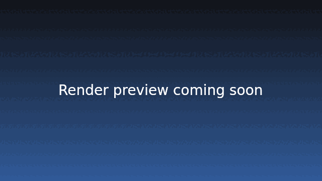
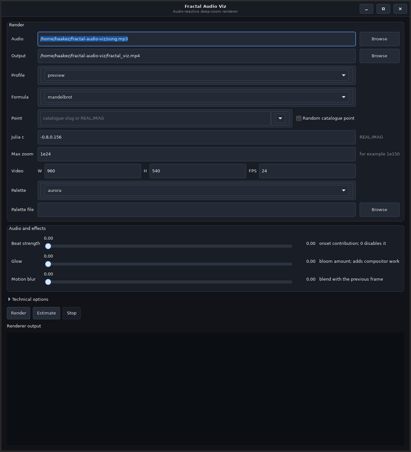

# fractal audio viz

[](images/preview.GIF)


fractal audio viz turns a song into a zoom through the Mandelbrot family:
Mandelbrot, Julia, Burning Ship, and Tricorn. Give it a local audio file and it
uses the music to control the camera and colours, then writes the video with
FFmpeg. The native Mandelbrot renderer is the fast path for very deep zooms;
the other formulas work too, but their deepest renders use a slower
formula-specific fallback.

## how it works

the render is roughly five stages:

1. **audio analysis.** the song is loaded as mono audio and resampled to
   `--sample-rate`. Loudness moves the camera, and pitch adds some colour
   movement. `--separation auto` tries Demucs first and falls back to the full
   mix if a vocal/instrumental split is not available. `--separation spectral`
   uses simpler frequency-band proxies. Onset strength is cached too, and can
   be added with `--beat-strength`.

2. **zoom planning.** the camera moves from `--base-zoom` to `--max-zoom` in
   logarithmic zoom space. Instrumental energy changes the speed. The default
   `--zoom-speed -0.04` lets it pull back a little during quiet parts, while
   the last frame still reaches the requested maximum.

3. **source images.** the default `atlas` mode builds a ladder of nested
   keyframes. Each one covers a `--keyframe-factor` interval. In-between frames
   are crops of those images, so the fractal is not recalculated 60 times a
   second. The older full-field renderer is still available with
   `--keyframe-mode legacy`.

4. **fractal rendering.** shallow views use the native renderer directly. For
   very deep Mandelbrot views, the C++ code builds an MPFR reference orbit and
   uses perturbation arithmetic, BLA maps, OpenMP, and a few depth-specific
   reference tiers to keep the work manageable. Julia, Burning Ship, and
   Tricorn use their own formula-aware path.

5. **colour and encoding.** keyframes contain scalar iteration data. It is
   colourised after cropping, using the native code when available. Ordinary
   palettes use Aurora's detailed wave as a base with different accents;
   `.kfp` files use Kalles' cyclic transfer, distance, colour, and slope
   settings. Atlas parent and child fields are joined before the KFP stencil is
   run, which keeps a new tile from showing up as a rectangle. Glow and motion
   blur are optional. FFmpeg then adds the original audio; `--codec auto` tries
   hardware encoders before falling back to `libx264`.

if you are using a `.kfp` palette, the native path follows the useful parts of
Kalles Fraktaler's CPU colour pipeline: a 1024-entry cyclic palette, sine
interpolation, distance and slope shading, and Kalles-style 8-bit dithering.
The palette and profile are cached. For atlas frames, both scalar tiles are
reprojected onto one screen-sized surface before colouring, so the glossy
gradient does not restart at the tile boundary.

the output size comes from `--width` and `--height`. The default
`lossless-compressed` source mode uses the native C++ field pipeline; profiles
above Full HD use a 1920×1080 source to keep the render practical.
`--source-mode native` renders one source sample per output pixel. For the fast,
lower-detail version, use `--source-mode upscaled` (or `--upscaling`), which
starts from a quarter-resolution source and enlarges it at the end.
`--render-scale` and `--fractal-scale` are there when you want to tune the
source density yourself.

### repository layout

| file | purpose |
| --- | --- |
| `visualizer.py` | audio analysis, zoom planning, keyframes, colour, and FFmpeg |
| `renderer.cpp` / `renderer.h` | the native renderer, deep zoom maths, and colour paths |
| `deep_zoom_points.py` | formula-specific point lists and long decimal centres |
| `palettes/` | built-in palettes, including the bundled Kalles `.kfp` file |
| `profiles.py` | render presets shared by the CLI and GUI |
| `gui.py` | the optional GTK launcher |
| `live_view.py` | the small fullscreen preview |
| `images/` | README and GUI images |
| `make_preview.py` | turns a render into a GIF or short MP4 |
| `point_sheet.py` | makes a labelled point catalogue image |
| `benchmark.py` | native field, compositor, and atlas benchmarks |
| `tests/` | Python and native tests |
| `shell.nix` / `Makefile` | the development environment and native build |

## installation and build

the supplied Nix shell includes Python, NumPy, librosa, Pillow, mpmath, ffmpeg,
GCC, GMP, MPFR, GTK3, and PyGObject. OpenCL is picked up when the host has the
right headers and ICD. If you are not using Nix, install the Python packages
from `requirements.txt` and run `make` with GMP, MPFR, and a C++ compiler
available.

```sh
nix-shell
make
make test
```

`make` creates `mandelbrot.so`. GMP and MPFR are needed for native deep zooms.
The Python renderer is handy for shallow previews and tests, but the deep
Mandelbrot path needs the native build. GTK is only needed for the GUI; command
line renders do not need it.

## running a render

the input song is the first argument. It can be any local file that librosa can
read, not just `song.mp3`. If you leave it out, the program looks for
`song.mp3`.

```sh
python3 visualizer.py path/to/my-song.mp3 \
  --output renders/my-song.mp4
```

paths containing spaces should be quoted:

```sh
python3 visualizer.py "Music/Live set.flac" \
  --output "renders/Live set.mp4"
```

the output directory is created when needed. Run `python3 visualizer.py --help`
if you want the full option list.

for a quick desktop launcher:

```sh
python3 gui.py
```
[](images/gui.png)

the GUI starts the same CLI in a child process. That keeps the window
responsive, and the command can still be copied from the log if you want to
run it again in a terminal. The advanced options are tucked away until you
need them. It follows the system GTK theme and shows a small preview for the
selected palette, including the cyclic gradient used by KFP themes.

## constructing a command

start with this shape:

```sh
python3 visualizer.py AUDIO --output OUTPUT [options]
```

then add the options you care about:

1. choose the input song and output file.
2. set `--width`, `--height`, and `--fps`.
3. choose a formula with `--formula`; for Julia, set its constant with
   `--julia-c`.
4. choose a centre with `--point`, `--random-point`, or `--x-center` plus
   `--y-center`.
5. set `--max-zoom` and, for a deep custom point, provide enough decimal
   digits in both coordinates.
6. choose a quality/speed trade-off with `--quality`, `--fractal-scale`, and
   `--keyframe-factor`; choose `--source-mode upscaled` when the fastest,
   lower-detail export is preferable to the lossless-compressed C++ pipeline.
7. add `--cache-dir` if you plan to resume or repeat the render.

profiles are just shortcuts for a group of settings. The main presets are
`sd60`, `hd60`, `fhd60`, `2k60`, `4k60`, and `8k60`. They all use 60 fps, e100,
the native bilinear colour path, and CRF 10. The larger three profiles use a
1920×1080 source field and upscale that to the requested output. Without a
profile, `4k60` is used. Options written after the profile override it.

```sh
python3 visualizer.py music/track.mp3 --profile 4k60 \
  --point random --random-seed 42 --output renders/track-4k60.mp4
```

the same 4K output can use the old fast quarter-resolution source explicitly:

```sh
python3 visualizer.py music/track.mp3 --profile 4k60 \
  --source-mode upscaled --point random --random-seed 42 \
  --output renders/track-4k60-upscaled.mp4
```

for a faster, lower-detail export, use the explicit upscaled source mode with
any resolution profile:

```sh
python3 visualizer.py music/track.mp3 --profile 4k60 --source-mode upscaled \
  --point random --random-seed 42 --output renders/track-4k60-upscaled.mp4
```

inspect the available presets with `python3 visualizer.py --list-profiles`.

for a larger native-pipeline export, change only the profile:

```sh
python3 visualizer.py music/track.mp3 --profile 8k60 \
  --point random --random-seed 42 \
  --output renders/track-8k60.mp4
```

CRF 10 is meant to look lossless while keeping the file smaller. Use
`--lossless` if you need actual H.264 losslessness, or choose a larger CRF if
you care more about render time and file size. Ordinary palettes use 4:2:0;
KFP and exact-lossless output use 4:4:4 so their colour edges stay sharp.

### common examples

a normal Full HD render using the canonical preset:

```sh
python3 visualizer.py music/track.mp3 \
  --profile fhd60 \
  --point oldwooddish \
  --output renders/track.mp4 \
  --cache-dir cache/track
```

the old names `preview`, `fullhd`, `1080p`, and `beat` still work as aliases for
the resolution tiers. Use `--source-mode upscaled` for the faster
quarter-density path. The old e150 profile names are gone; zoom depth and
source density are now separate options.

a reproducible random point:

```sh
python3 visualizer.py music/track.mp3 \
  --output renders/random-track.mp4 \
  --point random --random-seed 42 \
  --max-zoom 1e150 --cache-dir cache/random-track
```

`--random-point` is an equivalent flag-style spelling:

```sh
python3 visualizer.py music/track.mp3 \
  --random-point --random-seed 42 --max-zoom 1e150
```

list the points for the formula you want to render:

```sh
python3 visualizer.py --list-points
python3 visualizer.py --list-points --formula burning-ship
python3 visualizer.py --list-points --formula julia
```

each formula has its own point list. The Mandelbrot entries come from named KFR
files in the [MDZ gallery](https://mathr.co.uk/mdz/gallery/) and deep test views
in [FractalShark](https://github.com/mattsaccount364/FractalShark). Burning Ship
and Tricorn have separate hand-picked/generated boundary targets, and the
Julia presets include their `c` value. `random` chooses from the list for the
currently selected formula. Mandelbrot points are checked for the native deep
path; the alternate-formula points use the Python high-precision path.

to use your own centre, pass a comma-separated pair to `--point`. This works
for every formula and replaces that formula's preset:

```sh
python3 visualizer.py music/track.mp3 \
  --point=-0.743643887037151,0.131825904205330 \
  --max-zoom 1e12 --allow-underspecified-center
```

for a deep Mandelbrot render, replace that short pair with the full decimal
export from your zoom tool. The safety check wants at least
`ceil(log10(max-zoom)) + 16` fractional digits in both coordinates. That avoids
silently following a different target because the centre was rounded.
`--allow-underspecified-center` is for exploratory Mandelbrot renders. The
alternate formulas have their own presets and use the Python path at extreme
depth.

the two-coordinate form is also available for scripts and Kalles exports:

```sh
python3 visualizer.py music/track.mp3 \
  --x-center=-0.743643887037151000000000000000000000000000000000 \
  --y-center=0.131825904205330000000000000000000000000000000000 \
  --max-zoom 1e32
```

use either `--point` or the `--x-center`/`--y-center` pair, not both. The
`--point=...` and `--x-center=...` forms are convenient when a negative value
would otherwise be mistaken for another command-line option.

### formula examples

the default is Mandelbrot. These examples show the other formulas; their
coordinates describe the visible viewport.

```sh
# Julia set for c = -0.8 + 0.156i
python3 visualizer.py music/track.mp3 --formula julia --julia-c=-0.8,0.156 \
  --max-zoom 1e8 --output renders/julia.mp4

# Burning Ship with onset-driven punches and a custom palette
python3 visualizer.py music/track.mp3 --formula burning-ship \
  --max-zoom 1e8 --beat-strength 1.0 \
  --palette-file examples/palette-neon.txt --output renders/ship.mp4

# the remaining built-in is Tricorn (Mandelbar)
python3 visualizer.py music/track.mp3 --formula tricorn --max-zoom 1e7
```

use `python3 visualizer.py --list-formulas` for the complete list. The MPFR/BLA
deep-zoom accelerator is for the Mandelbrot parameter plane. Julia, Burning
Ship, and Tricorn use their own high-precision perturbation path, up to about
e300, instead of pretending to be Mandelbrot.

### resolution profiles

the six profiles all use 60 fps, e100, balanced atlas rendering, the native
bilinear colour path, and CRF 10. The larger profiles use a 1920×1080 source
field and upscale it, which is considerably more practical than calculating
the whole atlas at 4K or 8K.

| profile | output / default field source | max zoom | compression |
| --- | --- | --- | --- |
| `sd60` | 720×480 | e100 | CRF 10 |
| `hd60` | 1280×720 | e100 | CRF 10 |
| `fhd60` | 1920×1080 | e100 | CRF 10 |
| `2k60` | 2560×1440 / 1920×1080 | e100 | CRF 10 |
| `4k60` | 3840×2160 / 1920×1080 | e100 | CRF 10 |
| `8k60` | 7680×4320 / 1920×1080 | e100 | CRF 10 |

`4k60` is the default lossless-compressed C++ pipeline. Add
`--quality quality --fractal-scale 1` for a full-density field, and
`--lossless` for actual lossless H.264. If speed matters more, use
`--source-mode upscaled`, a larger `--keyframe-factor`, or a larger CRF.

for example, an 8K render is:

```sh
python3 visualizer.py music/track.mp3 \
  --profile 8k60 \
  --point random --random-seed 42 \
  --output renders/track-8k60.mp4 \
  --cache-dir cache/track-8k60
```

the legacy names are accepted as compatibility aliases for their corresponding
near-lossless compressed profiles. Source density is recorded explicitly with
`--source-mode` in the command and render manifest.

use `--estimate` to analyse the song and print the planned source resolution
and keyframe count without rendering video:

```sh
python3 visualizer.py music/track.mp3 \
  --profile 4k60 --estimate
```

### previews and point browsing

after a render, this helper finds the newest matching file and creates a
looping GIF:

```sh
python3 make_preview.py
```

or make a short MP4 explicitly:

```sh
python3 make_preview.py renders/track-4k60.mp4 \
  --format mp4 --duration 12 --width 1280 \
  --output renders/track-preview.mp4
```

to browse the curated deep points visually:

```sh
python3 point_sheet.py --output renders/deep-zoom-points.png
```

## `visualizer.py` argument reference

unless noted otherwise, the values in parentheses are the defaults.

### input, output, and audio

| argument | description |
| --- | --- |
| `audio` (`song.mp3`) | Positional input audio file. This is how you choose a custom song. |
| `--output PATH` (`fractal_viz.mp4`) | Output video path. |
| `--profile NAME` | Start from `sd60`, `hd60`, `fhd60`, `2k60`, `4k60` (the default), or `8k60`; legacy names remain accepted as aliases. Later options override the profile. |
| `--list-profiles` | Print the built-in profiles and exit. |
| `--width N` (`3840` with the default profile) | Output width in pixels. |
| `--height N` (`2160` with the default profile) | Output height in pixels. |
| `--fps N` (`60` with the default profile) | Output frame rate and audio-analysis frame rate. |
| `--sample-rate HZ` (`44100`) | Sample rate used while loading and analysing audio. |
| `--separation MODE` (`auto`) | `auto` tries Demucs and falls back to the full mix; `demucs` requires Demucs; `spectral` uses frequency-band proxies; `none` uses the full mix. |

### centre and zoom

| argument | description |
| --- | --- |
| `--point VALUE` | Select a slug from the catalogue for the chosen formula, `random`, or an exact `REAL,IMAG` decimal pair. With no point option, that formula's default centre is used. |
| `--random-point` | Select a point at random from the chosen formula's catalogue. Equivalent to `--point random`. |
| `--random-seed N` | Seed random point selection so the same command chooses the same entry. Without it, system randomness is used. |
| `--list-points` | Print every catalogue slug and its stored safe depth, then exit. An audio file is not needed. |
| `--list-formulas` | Print the supported Mandelbrot-family formulas and exit. |
| `--formula NAME` (`mandelbrot`) | Select `mandelbrot`, `julia`, `burning-ship`, or `tricorn`. |
| `--julia-c REAL,IMAG` (`-0.8,0.156`) | Fixed Julia constant used when `--formula julia` is selected. |
| `--x-center VALUE` | Exact real coordinate. Must be paired with `--y-center`. |
| `--y-center VALUE` | Exact imaginary coordinate. Must be paired with `--x-center`. |
| `--base-zoom VALUE` (`1.0`) | Starting zoom. Decimal notation such as `1e0` is accepted. |
| `--max-zoom VALUE` (`1e32`) | Final zoom. Native scaled arithmetic accepts values below about `1e9800`; Mandelbrot catalogue points have individual safety limits, while alternate formula presets are exploratory. |
| `--allow-underspecified-center` | Bypass the decimal-place guard for an exploratory render. It can follow a different deep path from the intended target. |

### audio response

| argument | description |
| --- | --- |
| `--zoom-punch N` (`3.0`) | Contrast applied to loud instrumental events. Larger values make beats change the logarithmic zoom more strongly. |
| `--zoom-speed N` (`-0.04`) | Quiet-time velocity in log-zoom space. `0` removes the default quiet pullback; more-negative values pull back farther between events. |
| `--attack SECONDS` (`0.025`) | Attack time for the audio envelope. Smaller values react faster. |
| `--release SECONDS` (`0.12`) | Release time for the audio envelope. Larger values smooth the response. |
| `--beat-strength N` (`0`) | Add normalised spectral-onset strength to zoom speed. `0` preserves the original loudness-only motion; `1`–`1.5` is a noticeable setting. |

### quality and fractal rendering

| argument | description |
| --- | --- |
| `--render-scale N` (`1.0`) | Multiplier applied to keyframe source dimensions. Must be at least `1`. |
| `--source-mode MODE` (`lossless-compressed`) | `lossless-compressed` honors the profile/quality source density and uses the fused native colour pipeline; `native` forces output-density fields; `upscaled` caps the source at `0.25×` and enlarges it at the end. `--upscaling` is a shorthand for the latter. |
| `--fractal-scale N` (profile-dependent; `0.25` for `8k60`) | Requested fractal source multiplier. Lossless-compressed mode honors it subject to the quality floor; native mode floors it at `1×`; upscaled mode caps it at the fast `0.25×` source. |
| `--quality MODE` (`balanced` with the canonical profiles) | `draft` permits labelled recovery; `balanced` is the practical atlas quality; `quality` requests at least output-density fields; `extreme` adds modest supersampling. Source density is selected separately with `--source-mode`. |
| `--keyframe-factor N` (`2.0`) | Maximum zoom ratio between adjacent atlas levels. Larger values reduce the number of fields but enlarge crops more. |
| `--keyframe-mode MODE` (`atlas`) | `atlas` uses the fixed nested ladder; `legacy` uses the older audio-dependent full-field chunks. |
| `--iteration-base N` (`384`) | Minimum iteration budget for shallow frames. |
| `--iterations-per-decade N` (`500`) | Additional iteration budget per decade of zoom. |
| `--iteration-cap N` (`100000`) | Hard maximum iteration budget. Increase it for unusually slow interior points. |
| `--series-order N` (`3`) | Local BLA polynomial degree. Values `1`–`3` are effective; values through `32` are accepted for compatibility and clamp to the native range. |
| `--series-block N` (`256`) | Requested BLA block length, from `2` to `4096`. The native renderer applies its validated limits. |
| `--renderer MODE` (`auto`) | `auto` uses the native library when available; `native` requires it; `python` forces the Python fallback and is limited to roughly e300. |
| `--native-threads N` (`0`) | OpenMP worker count. `0` selects an automatic runtime/video setting. |
| `--native-backend MODE` (`auto`) | Native backend: `auto`, `scalar`, `avx2`, or `opencl`. OpenCL is an optional direct/shallow backend and is rejected for deep perturbation renders. |

### video encoding and colour

| argument | description |
| --- | --- |
| `--video-preset MODE` (`faster` with a resolution profile) | x264 speed/size preset. Hardware encoders map this to their own speed levels when supported. |
| `--codec NAME` (`auto`) | FFmpeg video encoder. `auto` probes NVENC, QSV, VAAPI, and VideoToolbox at the requested output size, then validates the `libx264` fallback before selecting it. |
| `--crf N` (`10` with a resolution profile) | Quality value from `0` to `51`. CRF 10 is the near-lossless profile target; it is passed as CRF to software encoders and as the corresponding quality/QP control for supported hardware paths. |
| `--lossless` | Use lossless H.264 rate control where supported (`constqp/qp 0` for NVENC, CRF 0 for x264) and preserve 4:4:4 chroma where the encoder accepts it. |
| `--resample MODE` (`bilinear` with a resolution profile) | Crop and final upscale filter. Bilinear keeps the fused native colourizer active and is the fast pre-live path; Lanczos is sharper for explicit quality experiments but slower. |
| `--palette NAME` (`aurora`) | Colour palette: `aurora`, `fire`, `ocean`, `neon`, `sunset`, `mono`, `midnight`, `ember-night`, `terminal`, or `kalles-default`. The night themes use dark exteriors with white interiors; `kalles-default` matches the bundled Kalles Fraktaler profile in `palettes/kalles-default.kfp`. Its first exterior key is intentionally white and its separate interior colour is black, matching Kalles' defaults. |
| `--palette-file PATH` | Read at least two `#rrggbb` or `r g b` stops from a text file, or import a Kalles `.kfp` gradient and its colour settings. ordinary text palettes use the fast Aurora wave path; `.kfp` uses the Kalles-style transfer path. |
| `--glow N` (`0`) | Add a low-resolution bloom pass after colourisation, from `0` to `1`. It is off by default for the 10-minute target. |
| `--motion-blur N` (`0`) | Blend the current frame with the previous one, from `0` to below `1`. It is off by default. |
| `--encoder-threads N` (`0`) | FFmpeg encoder thread hint. `0` lets FFmpeg choose; a smaller value leaves more CPU for fractal rendering. Hardware encoders may ignore or reinterpret it. |

### caching and inspection

| argument | description |
| --- | --- |
| `--cache-dir PATH` | Store reusable scalar keyframes and audio-analysis data in this directory. Reusing the same settings and centre allows later runs to resume completed keyframes. |
| `--cache-limit-mb N` (`0`) | Maximum cache size in megabytes. `0` means unlimited. Eviction is incremental. |
| `--durable-cache` | Flush each cache tile before replacing its temporary file. Safer after power loss, but slower. |
| `--manifest PATH` | Write the render settings, selected point, formula, command, Git revision, timing, and status to JSON. Without this option the sidecar uses the output filename with a `.json` suffix. |
| `--no-manifest` | Disable the automatic JSON sidecar. |
| `--estimate` | Analyse the song and print source resolution/keyframe count without rendering the video. |

### safety and resource limits

there are some deliberately boring safety limits here: image sizes, audio
length, frame counts, sample rates, iteration counts, and coordinate strings
are checked before anything large is allocated. Native scaled arithmetic is
limited to zooms from `10^-300` to `10^9800`; the Python fallback tops out at
roughly `10^300`.

video files, previews, manifests, and cache fields are written atomically, so a
half-finished render should not replace a good one. Cache files are checked
before NumPy loads them. FFmpeg and Demucs also run in their own process group,
so cancelling a render can clean up their child processes too.

with `--codec auto`, the available hardware encoders get a small real encode
probe first. If the selected hardware path is unavailable, the renderer falls
back to `libx264`.

### reproducibility and fallback matrix

for reproducible output, keep the same Git revision, dependencies, command,
audio bytes, and exact centre coordinates. The cache knows about the renderer
version, but encoded bytes can still vary between FFmpeg builds, hardware
encoders, CPUs, and thread counts. Compare decoded frames or scalar fields when
that distinction matters.

| requested path | actual path | boundary |
| --- | --- | --- |
| `--renderer python` | Python direct/perturbed renderer | All formulas; exploratory fallback supports up to approximately `10^300`. |
| `--renderer auto` + shallow zoom | Native direct CPU renderer when available; Python fallback otherwise | All formulas; OpenCL is used only when explicitly selected. |
| `--renderer auto` + deep Mandelbrot | Native MPFR reference + scaled perturbation/BLA | Production path from approximately `10^12` through the validated catalogue depth. |
| `--renderer auto` + deep alternate formula | Python high-precision perturbation fallback | Julia, Burning Ship, and Tricorn use formula-specific boundary targets. |
| `--native-backend opencl` | Native OpenCL direct renderer | Mandelbrot-only shallow views; unavailable or deep paths fail clearly rather than silently changing numerical mode. |
| `--codec auto` | First passing hardware probe, otherwise `libx264` | The selected encoder is recorded in the manifest; hardware output is not byte-for-byte portable. |

## caching and reruns

cache entries include the centre, zoom, dimensions, iteration budget, renderer
version, and approximation settings. A renderer change gets a new cache
namespace, and tile writes are atomic.

the video is still assembled from the beginning on every run. That is necessary
for a valid compressed stream, even when the keyframes and audio analysis are
already cached.

normal renders also write a JSON manifest beside the output. It contains the
command, Git revision, audio path, formula, point, zoom plan, settings,
timings, and completion status. Use `--no-manifest` to skip it.

## gui and project tools

the GTK3 launcher uses the desktop's configured theme, including its light/dark
choice. It is only a front end for the CLI, so the same command can be run
without the GUI:

```sh
python3 gui.py
```

the GUI also has a **live view** button. It is a small screen-saver-style
preview: it prepares a short zoom ladder, follows the selected `base zoom` and
`max zoom`, and resets to the base view when the song loops. The first few
fields are prepared before playback and the rest are filled in in the
background. Press `esc` to close it or `f11` to toggle fullscreen.

the standalone command is:

```sh
python3 live_view.py song.mp3 --formula mandelbrot --palette aurora
```

the live view is deliberately much cheaper than an export. It caps the native
source at 480×270 (240×135 with the Python fallback), enlarges it to the window
size, and prepares at most 168 fields. It uses the fast atlas path and caps the
interactive zoom at e300. `ffplay` is used for audio playback when installed;
without it, the visual preview still works.

the live view is separate from the export profiles. Choosing `8k60` does not
make it allocate an 8K surface.

the repository also includes `examples/make_test_tone.py` for a dependency-free
audio smoke test, `point_sheet.py` for catalogue previews, and
`make_preview.py` for GIF/MP4 exports. Generated audio, videos, GIFs, caches,
and native build products are ignored by Git.

## benchmarking

`benchmark.py` measures the native renderer without involving audio or video
encoding. For example:

```sh
python3 benchmark.py --renderer native \
  --zoom-log 150 --reference-zoom-log 150 \
  --width 1920 --height 1080 --iterations 75384 \
  --threads 6 --repeat 1 --stats
```

you can also sweep the atlas or time the colour/compositor on its own:

```sh
python3 benchmark.py --stage atlas --renderer native \
  --zoom-log 150 --reference-zoom-log 150 \
  --width 512 --height 288 --iterations 75384 \
  --threads 6 --keyframe-factor 4 --stats

python3 benchmark.py --stage compositor --renderer native \
  --width 1920 --height 1080 --threads 6 --repeat 3
```

benchmark arguments:

| argument | description |
| --- | --- |
| `--stage` (`field`) | `field` renders one field, `atlas` renders every ladder level, and `compositor` measures the native colour/composite pass. |
| `--width`, `--height` (`256`) | Benchmark dimensions. |
| `--zoom` (`1e100`) | Decimal zoom for a field benchmark. |
| `--zoom-log` | Direct base-10 logarithm of the zoom; useful for exact atlas levels. |
| `--reference-zoom-log` | Reference/BLA setup depth. It must be at least the rendered depth. |
| `--iterations` (`20000`) | Iteration budget for the field. |
| `--x-center`, `--y-center` | Decimal benchmark centre; defaults to the bundled centre. |
| `--formula` (`mandelbrot`) | Formula to benchmark: `mandelbrot`, `julia`, `burning-ship`, or `tricorn`. |
| `--julia-c` (`-0.8,0.156`) | Fixed Julia constant when benchmarking the Julia formula. |
| `--renderer` (`auto`) | `auto`, `native`, or `python`. |
| `--backend` (`auto`) | `auto`, `scalar`, `avx2`, or `opencl`. OpenCL is shallow only. |
| `--threads` (`0`) | Native OpenMP worker count. |
| `--series-order` (`3`) | Local BLA degree. |
| `--disable-series` | Disable the validated image-wide series for comparison. |
| `--series-block` (`256`) | Requested BLA block length. |
| `--local-references` | Exercise adaptive secondary references for a deep field. |
| `--repeat` (`2`) | Number of repeated field/compositor timings. |
| `--keyframe-factor` (`2.0`) | Atlas spacing for `--stage atlas`. |
| `--iteration-base`, `--iterations-per-decade`, `--iteration-cap` | Match the visualizer’s iteration policy. |
| `--stats` | Collect native BLA, fallback, glitch, and timing counters. |
| `--verbose` | Print one line per atlas level. |
| `--json` | Emit the result as JSON. |

## deep-zoom notes

the deep-zoom code uses the usual reference-orbit and perturbation approach
described in [mathr’s deep-zoom notes](https://mathr.co.uk/web/deep-zoom.html).
The MPFR reference is kept separate from the small per-pixel offsets, and the
hot loop uses scaled values and BLA maps. Extra depth tiers reuse the orbit and
only rebuild the radius-dependent bounds.

the bundled centre has 129 fractional decimal places. That is enough for the
tested e100 path, but not for an unqualified e150 render. Use a catalogue point
or paste the full-precision centre from a zoom tool.

for more native-renderer details, see the declarations in
[`renderer.h`](renderer.h) and the source-attributed catalogue in
[`deep_zoom_points.py`](deep_zoom_points.py).

## license

this project is released under the [MIT License](LICENSE).

## troubleshooting

- **audio file not found:** pass the path as the first argument, for example
  `python3 visualizer.py "Music/track.mp3"`.
- **native renderer unavailable:** run `nix-shell` followed by `make`. Deep
  renders cannot use the Python fallback beyond its supported range.
- **centre precision error:** use `--list-points`, lower `--max-zoom`, or pass
  the full decimal coordinates. Only use `--allow-underspecified-center` when
  the exact deep target is not important.
- **Demucs error:** use `--separation none` for full-mix control, or install
  Demucs and keep `--separation auto`/`demucs`.
- **hardware encoder error:** leave `--codec auto` enabled so the available
  hardware path is probed at the requested output size and `libx264` is
  validated as a fallback when necessary.
- **alternate formula is slow at extreme depth:** the Mandelbrot e150+ path
  has the native BLA accelerator. Julia, Burning Ship, and Tricorn use the
  slower Python perturbation fallback for deep boundary targets.
- **GUI will not start:** install GTK3 and PyGObject for the system Python, or
  enter the supplied `nix-shell`. Headless CLI renders do not need GUI
  dependencies.
